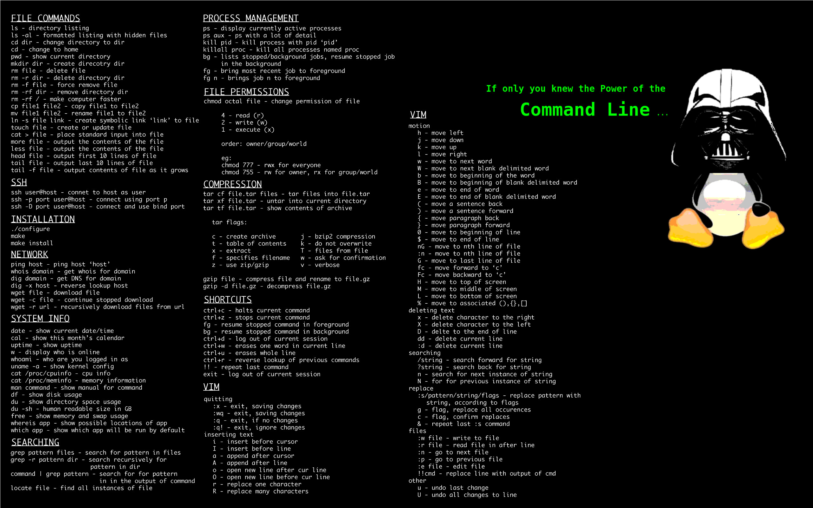

# Introdução ao Shell Script 

## Comandos básicos
| Comando | Descrição | Sintaxe |
----------|-----------|---------|
| echo    | Exibe o texto na tela | echo “texto a ser mostrado” |
|sleep    | Dá um tempo antes de continuar executando | sleep segundos exemplo: Sleep 1 |
| read    | Recebe o valor de uma variável (veremos ainda) read variável | exemplo: read dados |
| >       | Escreve num arquivo-texto (apagando o que estava lá) | echo “texto” > /home/"user"/arquivo   |
| >>      | Escreve num arquivo-texto (última linha, não apaga) | echo “texto” > /home/"user"/arquivo   |
| &       | Roda o comando em 2o plano e continua o script | Comando & |
| exit    | Sai do script | exit |
| touch   | Cria arquivos-texto | touch nome_do_arquivo |
| #       | Comenta tudo depois deste símbolo | # Comentário |

## Manipulação de Diretórios
| Comando | Descrição | Sintaxe |
--------|-----------|---------|
| rm    |-rf rm -rf +diretório | Deleta arquivos/pastas e tudo que estiver dentro (cuidado) |
| pwd   | pwd | Mostra o caminho do diretório atual  |
| mkdir | mkdir nome_pasta | Cria uma pasta |
| ls    | ls | Mostra os arquivos do diretório atual |
| chmod | chmod 777 arquivo_ou_pasta | Muda as permissões, 777 = permissão total |
| chown | chown user:grupo arq_ou_diret. | Muda o proprietário de arquivos e pastas |
| cd    | cd diretório | Entra em diretórios |

## Comandos de Usuários
| Comando | Descrição | Sintaxe |
-----------|-----------|---------|
| useradd  | useradd nome_usuario -g alunos (no grupo)  | Adiciona um usuário |
| userdel  | userdel usuário | Deleta usuário e seus arquivos |
| groupdel | groupdel grupo  | Deleta um grupo |
| groups   | groups nome_usuario | Mostra os grupos do usuário |
| addgroup | addgroup usuario grupo ou addgroup nomedogrupo | Cria um grupo ou adiciona um usuário ao grupo |
|sudo      | sudo comando | Executa comandos como root |
|whoami    | whoami       | Identifica com qual usuário você esta logado |

## Redes
| Comando  | Descrição | Sintaxe |
-----------|-----------|---------|
| ifconfig | ifconfig  | Mostra as interfaces de rede |
| hostname | hostname  | Mostra ou muda o nome de seu computador na rede |
| ping     | Ping      | ip_desejado Dispara pacotes para outro pc, para testar conexões etc |

## Manipulação do sistema
| Comando  | Descrição | Sintaxe |
-----------|-----------|---------|
| killall | killall nome_do_programa | Mata um processo |
| xkill   | xkill | Mata um programa |
| whatis | whatis +nome do programa | Descreve o que faz o comando |
| diff   | diff arquivo1 arquivo2   | Compara os dois arquivos |
| ps    | ps -elf                  | Mostra os programas que estão rodando |
| cat   | cat arquivo_texto        | Mostra o conteúdo de um arquivo de texto |
| grep | Comando | grep palavra | Filtra a saída do comando, mostra a linha da palavra pedida |
| ln     | ln -s arquivo_original atalho | Cria atalho |
| cp     | cp arquivo destino | Copia um arquivo ou diretório (-R para diretórios) |
| find   | find +nome Procura por arquivos e diretórios |

# Linguagem Shell 

## Variável

~~~bash 
# Escrever
echo "Hello World"

# Atribuição 
RESPOSTA = $"certo"

# Recebe valor atribuido pelo usuário
echo "Escreve sua resposta"
read RESPOSTA

# Atribuição por arquivo texto
ALUNO=$(cat /home/resposta.txt)
~~~

## Operadores Lógicos

### Comparadores Númericos
* **-lt** Número é menor que (Less Than)
* **-gt** Número é maior que (Greater Than)
* **-le** Número é menor ou igual (Less Equal)
* **-ge** Número é maior ou igual (Greater Equal)
* **-eq** Número é igual (EQual)
* **-ne** Número é diferente (Not Equal)

### Comparadores Alfanuméricos
* **=** Texto é igual
* **!=** Texto é diferente
* **-n** Texto não nulo
* **-z** Texto é nulo

## Operadores de Seleção
~~~bash
# Estrutura If
# Espaçamento obrigatório
if [ "$USER" = "ANA"  ];then
    mkdir $USER
fi

# Estrutura If (...) Else
if [ "$USER" = "ANA"  ];then
    mkdir $USER
    
    else 
        echo "Error: Usuário não existe"
fi

# Estrutura Case
case $TESTE in
    1) echo "Opção 1"
    2) echo "Opção 2"
    *) echo "Opção Inválida"
    exit;; 
esac

~~~

## Laço de repetição
~~~bash
# Estrutura For
for ((LOOP=0; LOOP<3; LOOP++));do 
    echo $LOOP
done

# Estrutura While
LOOP =$"0"  
while [ $LOOP -lt 3 ];do
    echo $LOOP
    $LOOP =$[ $LOOP + 1 ] 
done

# Estrutura Until
LOOP =$"0"  
until [ $LOOP -lt 3 ];do
    echo $LOOP
    $LOOP =$[ $LOOP + 1 ]
done
~~~
